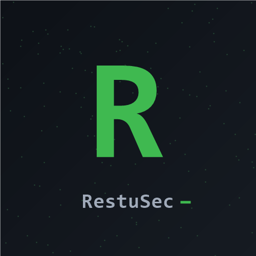

# RestuSec — Sistem Absensi Murid



Sistem absensi murid dengan **Dashboard Web + Absen via QR** oleh **RestuSec**.

---

## 📁 Struktur Project

```
absensi-murid/
├── backend/
│   ├── main.py          ← FastAPI API
│   ├── serve.py         ← Entry point (API + Dashboard)
│   ├── database.py      ← SQLite setup
│   └── requirements.txt
├── dashboard/
│   ├── login.html
│   ├── index.html          ← Dashboard admin (Data Absensi / Murid & QR / Rekap)
│   ├── absen.html          ← Halaman absen web (dibuka lewat scan QR)
│   └── static/
│       ├── css/style.css
│       ├── js/app.js
│       └── img/logo.png
├── env_loader.py        ← Loader .env tanpa dependency eksternal
├── start_all.bat        ← Launcher proses (Windows)
├── stop_all.bat         ← Stop semua proses
└── .env.example         ← Template konfigurasi (copas jadi .env)
```

---

## 🚀 Cara Install & Jalankan

### 1. Clone / copy folder project

### 2. Install dependency
```bash
cd backend
pip install -r requirements.txt
```
> Wajib dijalankan dari folder `backend` karena ada `requirements.txt` di sana.

### 3. Konfigurasi
```bash
# Di folder root project
cp .env.example .env
# Edit .env, isi SECRET_KEY, password admin,
# dan PUBLIC_URL (ganti ke IP LAN/server saat diakses dari HP).
```

### 4. Jalankan Backend + Dashboard
```bash
cd backend
python serve.py
```
Dashboard bisa diakses di: **http://localhost:8000**

> **Akses dari HP:** pastikan HP dan komputer di jaringan yang sama, lalu buka
> IP komputer, contoh: **http://192.168.10.21:8000**. Setel `PUBLIC_URL` di
> `.env` ke IP itu supaya QR mengarah ke alamat yang benar.

> Server ini **tidak** otomatis reload. Setelah mengubah kode backend, restart dulu `serve.py`.

### 5. Jalankan (opsional)
```bash
# Windows: jalankan start_all.bat untuk membuka backend + dashboard.
# Tutup dengan stop_all.bat.
```

### 6. Jalankan satu-klik via tunnel (untuk akses dari HP/Internet)
```powershell
cd C:\Users\Suran\Documents\absensi-murid
.\start_jumat.bat
```
Script otomatis: buka server + Cloudflare tunnel gratis → update `.env` → tampilkan URL publik.
Tiap start URL berubah, jadi **generate ulang QR murid** setelahnya.

---

## 🔐 Akun Admin

Akun admin dibuat otomatis dari `.env` saat server pertama kali jalan:

| Username | Env var      |
|----------|--------------|
| `admin`  | `ADMIN_PASS` |

> **Penting:** Jangan pernah pakai password default / simpan password di file kode.
> Password diambil dari `.env` (`.gitignore` sudah mengecualikannya dari git).

---

## 📱 Alur Murid

1. Admin di **Murid & QR** klik **📱 Tampilkan** → QR muncul
2. Murid scan QR pakai kamera HP → terbuka `absen.html` → isi **✅ Hadir / 📋 Izin / 🏥 Sakit**
3. Hasilnya langsung masuk ke dashboard

---

## 📊 Fitur Dashboard

- ✅ Login admin, username+password otomatis tersimpan
- ✅ **Murid & QR**: tambah murid (nama, kelas, **urutan**), tampilkan QR, **unduh** QR, **kirim via WhatsApp**, dan **buat token baru** (🔄) kalau QR bocor
- ✅ Urutan: daftar absensi & rekap diurutkan sesuai nomor **urutan** murid, bukan waktu input
- ✅ Ganti tanggal → data langsung ke-load hari itu
- ✅ Statistik: Total, Hadir, Izin, Sakit
- ✅ **Long-press row** untuk masuk mode hapus (pilih satu / select all / hapus)
- ✅ Export Excel (dengan warna status)
- ✅ Dark / Light mode

---

## ⚙️ Ganti Password Admin

Edit file `.env` di root project, lalu restart server:

```env
ADMIN_PASS=password_baru
```

Server otomatis mendeteksi password baru dan meng-update hash bcrypt di database
saat startup (lihat `seed_admin()` di `backend/database.py`).

---

## 🌐 Deploy ke Server

Saat di-deploy, ubah `PUBLIC_URL` di `.env` ke URL/domain server. Untuk
production, gunakan nginx sebagai reverse proxy ke port 8000.

### Deploy ke Railway (dari GitHub)

1. Push repo ini ke GitHub.
2. Di [Railway](https://railway.app), **New Project → Deploy from GitHub repo** → pilih `absensi-murid`.
3. Tambahkan **Volume** (persistent) di service, lalu buat **variable** berikut di `Variables`:
   - `DB_PATH=/data/absensi.db` (arahkan ke mount volume — wajib, biar data tidak hilang saat redeploy)
   - `SECRET_KEY`, `ADMIN_PASS`
   - `PUBLIC_URL=<URL Railway milikmu>`
   - `CORS_ORIGINS=<URL Railway milikmu>`
4. Railway otomatis menjalankan `backend/serve.py` via `railway.json` dan memberi `PORT`.
5. Akses dashboard lewat URL Railway (diakhiri `/login`).